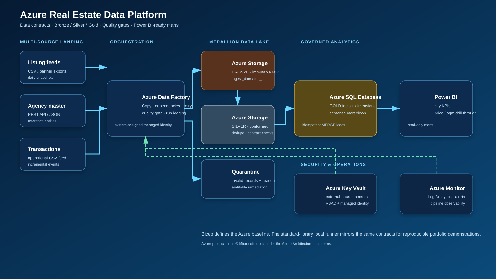

# Azure Real Estate Data Platform

An end-to-end cloud data engineering portfolio project that turns real-estate listings, agency master data, and transactions into governed Power BI-ready analytics.

> Status: executable local reference implementation plus Azure deployment baseline. The repository contains no cloud credentials, customer data, or deployed resource endpoints.



## What this demonstrates

| Capability | Implementation |
|---|---|
| Ingestion | Azure Data Factory assets, parameterized Copy activities, immutable Bronze snapshots |
| Medallion model | Landing → Bronze → Silver → Gold contracts with partitions and quarantine |
| Quality | Required fields, type checks, Morocco coordinate checks, referential integrity, and deduplication |
| Reliability | Run IDs, checksums, retry policy, checkpoint ledger, idempotent Gold loads, reconciliation metrics |
| Security | Managed identity, RBAC, Key Vault boundary, no public blobs, TLS, private-network-ready SQL |
| Observability | ADF diagnostics to Log Analytics plus an alerting runbook |
| Analytics | Azure SQL dimensions/facts and Power BI-friendly market views |

## Architecture

```text
Listing CSV / Agency API / Transaction CSV
                │
        Azure Data Factory
                │
Landing → Bronze (raw) → Silver (conformed) → Azure SQL Gold → Power BI
                         └→ Quarantine (invalid records)
```

Key Vault plus managed identity secure integrations. Azure Monitor plus Log Analytics observe pipeline health. See [architecture decisions](docs/architecture.md) and the [Gold data model](docs/data-model.md).

## Run locally

The local runner uses only the Python standard library. It mirrors cloud contracts using the filesystem as Blob Storage and SQLite as an Azure SQL analogue.

```powershell
python -m real_estate_platform.cli run --as-of 2026-09-10
python -m real_estate_platform.cli inspect
python -m unittest discover -s tests -v
```

Expected outcome: 4 accepted agencies, 12 accepted listings, 8 accepted transactions, 9 rejected rule violations in quarantine, and 5 city-level Power BI mart rows.

## Azure deployment

`infra/main.bicep` creates Azure Storage, Data Factory, Key Vault, Log Analytics, Azure SQL Database, RBAC assignments, and diagnostic settings. ADF templates live in `adf/`; production SQL scripts live in `sql/`.

Follow the [deployment guide](docs/deployment.md). You provide the Azure subscription, resource group, unique naming prefix, secure SQL credentials, private connectivity, and Entra SQL administration.

## Repository map

```text
assets/                    Architecture diagram and official Azure product icons
adf/                       Linked services, datasets, and pipeline templates
config/                    Source contracts
data/source/               Fictional, non-sensitive demonstration data
docs/                      Architecture, operations, deployment, data model, and CV entry
infra/main.bicep           Azure resource baseline
real_estate_platform/      Executable Bronze → Silver → Gold runner
sql/                       Azure SQL schema, marts, staging, and publish procedure
tests/                     Quality, end-to-end, and idempotency coverage
```

## Production boundary

This is a portfolio-quality reference implementation, not a deployed production tenant. A production rollout needs subscription-specific networking, private endpoints, Azure SQL Entra administration, retention policy, formal source agreements, and a cost review. The architecture intentionally keeps all real credentials and service endpoints out of Git.

## CV entry

The polished French CV section is ready in [`docs/cv-entry.tex`](docs/cv-entry.tex).

## Icon attribution

Azure product icons are the official [Azure Architecture Icons](https://learn.microsoft.com/azure/architecture/icons/) and are used to identify Microsoft services in the diagram.
