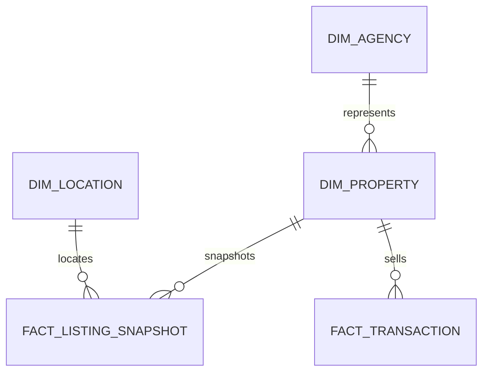

# Gold data model

## Power BI marts

- `mart.vw_city_market`: inventory, active listings, average price, average price per square meter, transaction count, and average sale price by city and snapshot date.
- `mart.vw_property_type`: inventory, area, listing price, and price per square meter by property type and snapshot date.

Use one-way dimension-to-fact relationships in the semantic model. Keep source-of-truth transformations in ADF and Azure SQL; keep presentation measures in DAX.
